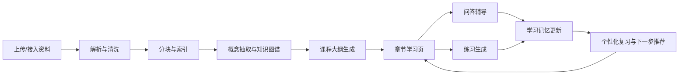
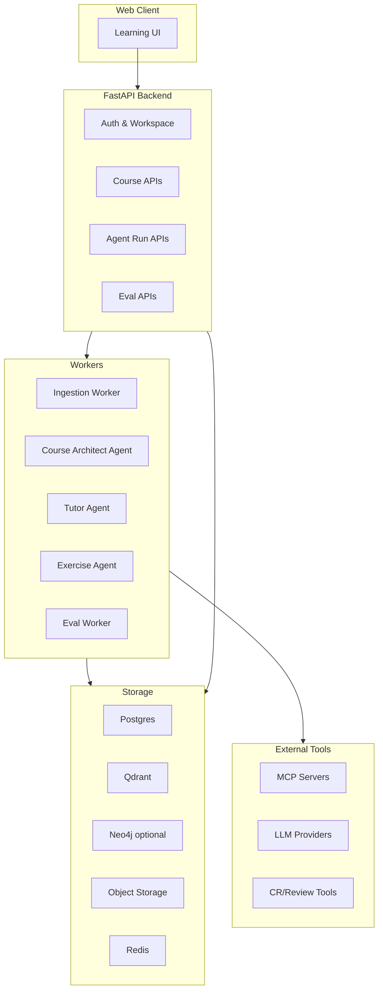

# HelloAgents 学习平台扩展蓝图

版本日期：2026-07-08  
目标：把当前教学型 agent demo 扩展成一个可部署、可演示、可维护、可作为面试主项目讲述的通用学习 agent 平台。

## 0. 一句话定位

这个项目最适合被定位为：

> 一个以资料驱动的个人学习 agent 平台。用户上传或接入学习资料后，系统自动完成资料解析、知识结构化、RAG 检索、课程章节生成、练习与讲解生成、学习过程记忆和效果评估，并通过一个认真设计的网页端提供可持续学习体验。

它不是单纯的 chatbot，也不是单纯的 RAG demo。面试叙事要落在三个词上：可解释、可维护、可评估。

## 1. 当前项目真实状态

### 1.1 已经拥有的资产

当前仓库本质上是一个轻量教学型 agent 框架，核心理念是“除了 Agent 基类，一切皆为 Tools”。这其实非常适合往学习平台扩，因为学习平台天然需要大量可插拔能力：文档解析、检索、记忆、题目生成、代码运行、评测、搜索、MCP 外部连接等。

现有能力可以这样归类：

| 方向 | 已有代码依据 | 可复用价值 |
|---|---|---|
| LLM 统一入口 | `hello_agents/core/llm.py` | 支持 OpenAI-compatible provider，可接 OpenAI、DeepSeek、Qwen、ModelScope、本地 Ollama/vLLM |
| Agent 范式 | `hello_agents/agents/` | Simple、FunctionCall、ReAct、Reflection、PlanAndSolve，可用来解释 agent 运转模式 |
| 工具系统 | `hello_agents/tools/base.py`、`registry.py` | Tool schema、工具注册、可展开工具、异步批量工具，是平台能力插件化的基础 |
| Memory | `hello_agents/memory/`、`MemoryTool` | 工作记忆、情景记忆、语义记忆、感知记忆的概念已经成型 |
| RAG | `hello_agents/memory/rag/pipeline.py`、`RAGTool` | MarkItDown 文档解析、chunk、embedding、Qdrant、检索扩展、rerank、citation 的骨架已有 |
| MCP/A2A/ANP | `hello_agents/protocols/` | 可以展示协议化工具接入和多 agent 协作 |
| Context Engineering | `hello_agents/context/builder.py` | 已有 GSSC：Gather、Select、Structure、Compress 思路 |
| Evaluation/RL | `hello_agents/evaluation/`、`hello_agents/rl/` | 可作为后期质量保障和面试亮点，不建议第一阶段深入产品化 |

### 1.2 当前还不是主项目的原因

现在的问题不是“缺少 agent 概念”，而是“缺少产品闭环和工程闭环”。

主要短板（已剔除本轮已修复的 API/文档漂移项）：

1. 还没有真正的 Web 产品层。没有用户、课程、资料库、练习、学习进度、后台任务、权限和部署入口。
2. RAG 和 Memory 已是工具，但还不是平台级数据管线。缺少任务队列、状态机、可重试 ingestion job、文档版本、引用定位、召回评估。
3. 测试覆盖仍偏核心工具。当前已补上 RAGTool 兼容 action 和 MemoryTool metadata 的回归测试，但尚未覆盖真实 Qdrant/embedding 主路径、协议集成、文档 ingestion、agent loop、工具调用失败恢复。
4. RAG 文档更新/删除已有兼容入口，但仍属于轻量实现。现阶段能保证示例和 API 不再明显漂移，后续平台化时还需要业务库中的文档版本、任务状态和可审计删除。
5. 许可证是 CC BY-NC-SA 4.0。作为面试展示没有问题，但如果未来想商业化，需要明确原项目授权边界，或把自研平台代码与教学框架代码边界隔开。

这些短板反而是好事。它们给项目提供了从 demo 到工程项目的真实演进路线，面试里能讲得很扎实。

### 1.3 本轮修复后的干净起点

2026-07-08 已完成一轮一致性修复，进一步工作的起点变为：

- `RAGTool` 已兼容示例和文档中的 `embedding_model` 参数，支持 `local`、`dashscope`、`tfidf`、`sentence-transformers`/`huggingface` 等别名。
- `RAGTool.run` 已补齐文档中提到的 `get_context`、`update_document`、`remove_document`、`clear_kb` action。
- Qdrant 存储层已增加按 payload 过滤删除向量的能力，用来支撑文档更新/删除。
- `MemoryTool._add_memory` 已支持显式 `metadata`，`auto_record_conversation` 和 `add_knowledge` 不再通过额外关键字参数写入元数据。
- `docs/api/memory/index.md` 中过期的 extras 名称已从 `mem`/`mem-rag` 统一为当前 `memory`/`memory-rag`，版本号同步到 `0.2.9`。
- 已新增回归测试覆盖 RAG 兼容 action 和 Memory metadata 写入；当前 `python -m pytest -q` 结果为 `8 passed`。

## 2. 面试展示主线

建议把项目包装成四条主线，而不是堆功能。

### 2.1 Agent 基础主线

目标：证明你不是只会调用大模型 API，而是理解 agent 系统的组成。

可展示内容：

- Agent 运转模式：Simple、FunctionCall、ReAct、Reflection、PlanAndSolve 的差异。
- Tool abstraction：为什么把 Memory、RAG、MCP 都作为 tool，优点是统一调用入口，缺点是能力边界容易混。
- Memory：工作记忆处理当前会话，情景记忆记录学习事件，语义记忆存用户画像和长期知识，感知记忆承接多模态材料。
- RAG：资料解析、chunk、embedding、向量检索、图增强、rerank、引用、答案生成。
- MCP：将外部服务做成标准化工具连接，避免每接一个服务就改 agent 核心。
- Context engineering：用 GSSC 控制上下文，不把所有历史都塞进 prompt。

面试表达：

> 我不是直接做了一个聊天机器人，而是先做 agent runtime 的可解释抽象，再把学习业务接到 runtime 上。每一个 agent 能力都有对应的数据层、工具层和质量评估方式。

### 2.2 可部署主线

目标：证明项目不是玩具，而是能跑、能维护、能控成本。

第一版部署不应该追求复杂。推荐从 Docker Compose 开始：

- `web`：Next.js 或 React/Vite 前端。
- `api`：FastAPI 后端。
- `worker`：异步文档解析、embedding、课程生成、题目生成。
- `postgres`：用户、课程、任务、题库、学习记录、agent run 元数据。
- `qdrant`：向量库。
- `redis`：任务队列和短期缓存。
- `neo4j`：第二阶段可选，不要第一天引入强依赖。
- `object storage`：本地 volume 起步，后续 S3/R2/OSS。

部署策略：

| 阶段 | 部署方式 | 目标 |
|---|---|---|
| local demo | Docker Compose | 保证面试现场能一键跑起来 |
| public demo | 单台 VPS 或 Render/Fly/Railway | 让别人能访问、能上传小资料 |
| stable beta | 云数据库 + Qdrant Cloud/自托管 + 对象存储 | 解决备份、扩容、任务恢复 |

成本控制：

- 上传资料后的 embedding 结果必须持久化，避免重复计费。
- 课程章节、题目、讲解生成要有版本缓存。
- 检索阶段优先本地 embedding 或低价 embedding；最终讲解可用更强模型。
- 给每个 workspace 设置月度 token 预算和单任务最大预算。
- 所有 agent run 写入 `agent_runs`、`tool_calls`、`cost_events`，面试时能展示成本看板。

### 2.3 人机协作开发主线

目标：证明你会和 agent 协同，而不是“问一句、改一下、肉眼验一下”。

建议建立一套 SDD + Agent 的开发方法。这里的 SDD 可以解释为 Specification Driven Development：

1. 先写 `spec`：用户故事、接口契约、数据模型、验收标准、失败模式。
2. 再让 agent 实现：限定文件范围、限定修改目标、要求补测试。
3. 再让 agent 自审：用 code review 模式找风险、行为回归和测试缺口。
4. 再运行自动化验证：单测、集成测试、lint、关键截图。
5. 再做人工验收：只看 diff、测试结果、关键 UI，而不是逐行陪 agent 写。

这套流程的核心不是“完全相信 agent”，而是把 agent 的自由度放在工程护栏里。

建议沉淀的协作产物：

- `docs/<NN-stage-name>/specs/`：每个功能一份 spec。
- `docs/<NN-stage-name>/adr/`：架构决策记录，比如为什么选 Qdrant、为什么 Neo4j 后置。
- `docs/<NN-stage-name>/evals/`：评测集设计和结果。
- `docs/<NN-stage-name>/reviews/`：OCR/CR review 摘要和采纳/拒绝原因。
- `AGENTS.md`：给 coding agent 的仓库约定，包含测试命令、禁止事项、风格约束。
- `prompts/` 或 `skills/`：可复用的开发技能，如“写 FastAPI CRUD”“补 RAG eval”“做 UI 截图审查”。

长时间无审核开发实验建议这样做：

| 实验级别 | 允许 agent 自主做什么 | 不允许做什么 | 验收方式 |
|---|---|---|---|
| L1 | 文档、测试、类型注解、小 bug | 改数据库 schema、改核心 agent loop | diff + tests |
| L2 | 一个小后端 endpoint + 测试 | 安全/鉴权/删除类操作 | API contract test |
| L3 | 一个完整但低风险功能分支 | 直接合入主分支、改部署密钥 | PR review + staging |

你要记录体验：

- 什么任务 agent 很适合：机械重构、补测试、文档同步、根据现有模式扩一个 endpoint。
- 什么任务不适合无审核：业务边界不清、数据迁移、安全策略、复杂前端交互、性能调优。
- 怎么省 token：先给文件地图和 spec，不让 agent 全仓乱读；把反复出现的要求写进 `AGENTS.md`/技能；让 agent 输出检查清单而不是长篇解释；用测试和日志替代自然语言确认。
- 怎么保证质量：小步 PR、强测试、trace、eval、自动截图、review bot、人工只审关键决策。

导师的阿里 CR 开源项目已经可以落到本机流程里：当前 Codex skill 名为 `ocr-codex-app`，位置是 `C:\Users\Admin\.codex\skills\ocr-codex-app`，它封装本地 OpenCodeReview CLI。CLI 不在 PATH 里，但可直接调用 `C:\Users\Admin\bin\ocr.exe`；`ocr version` 返回 `open-code-review dev windows/amd64`，在干净工作树上 `ocr review --preview` 能正常返回 `No files changed.`。在 Codex App 的沙箱里，OCR 首次写入 `C:\Users\Admin\.opencodereview\sessions` 可能需要授权；授权后预览流程可用。当前预览也暴露了一个边界：Markdown 文档会被标为 `unsupported_ext` 并排除，所以 OCR 更适合作为代码 diff 的审查门禁，而不是文档审校工具。它的最佳接入方式不是“拿来替代 Codex”，而是作为独立 PR gate：agent 实现后，OCR 做结构化 review，再由 Codex 根据 review comment 修复，最后你做最终裁决。

建议把协作流程升级为：

1. `spec`：先写清用户故事、验收标准、边界和禁止修改范围。
2. `implement`：Codex 按 spec 小步实现，并补测试。
3. `self-review`：Codex 先做一次普通代码审查，消掉明显问题。
4. `ocr-preview`：运行 `C:\Users\Admin\bin\ocr.exe review --preview`，确认评审范围没有误包含无关文件。
5. `ocr-review`：需要真实审查时运行 `C:\Users\Admin\bin\ocr.exe review --audience agent --background "<业务背景>"`；这一步会消耗 OCR 自己配置的 LLM provider 额度，不消耗 Codex App 额度。
6. `fix`：只自动修 High 和高置信 Medium；Low 级建议记录但不盲改。
7. `verify`：跑 pytest/lint/eval，必要时再做一次 OCR 复审，但避免无限 review loop。

这个流程的价值在于形成“agent 写、另一个 reviewer 审、agent 修、人最终裁决”的闭环。面试时可以把它讲成一种可复用的 agent-assisted engineering workflow，而不是简单的人机对话。

### 2.4 学习平台主线

目标：把“背八股 + 刷 LeetCode”扩展成通用学习平台。

核心闭环：



第一版只要把闭环跑通，不要一开始追求“万能学习”。建议先选两个垂直场景：

- 八股学习：结构清晰，适合概念图谱、重要程度、面试问答、错题记忆。
- LeetCode/算法：适合题型分类、例题链接、代码运行、复杂度讲解、相似题推荐。

等这两个场景稳定，再开放到任意资料学习。

## 3. 目标产品形态

### 3.1 用户故事

核心用户故事：

1. 用户创建一个学习空间，比如“操作系统面试”“算法图论”“软件质量课程”。
2. 用户上传 PDF、Markdown、网页链接、代码文件或笔记。
3. 系统后台解析资料，生成资料库、知识点、章节结构和学习路径。
4. 用户进入章节页，看到知识点、重要程度、先修关系、例题、引用来源。
5. 用户可以问问题，回答必须引用资料来源；资料不足时要明确说明。
6. 系统根据章节生成练习、面试问答或编程题。
7. 用户作答后，系统讲解、评分，并记录薄弱点。
8. 下次学习时，系统根据记忆推荐复习内容和下一章节。

### 3.2 前端页面结构

前端不做营销页，第一屏就是可用的学习工作台。

推荐页面：

| 页面 | 作用 |
|---|---|
| Dashboard | 学习空间列表、最近学习、待复习、处理中的资料 |
| Workspace | 当前学习空间总览，资料、章节、知识图谱、进度 |
| Ingestion Center | 上传资料、查看解析状态、失败原因、重试 |
| Course Reader | 核心学习页，左侧章节树，中间内容，右侧知识点/引用/练习 |
| Concept Map | 知识点关系、先修关系、重要程度、薄弱点 |
| Tutor Chat | 带引用的问答，不脱离当前章节上下文 |
| Practice | 模拟题、面试题、编程题、错题本 |
| Review Queue | 间隔复习队列，根据错题和薄弱知识点生成 |
| Run Trace | 面向开发者和面试展示的 agent 运行轨迹 |
| Cost & Quality | token、延迟、命中率、引用率、评测分数 |

Course Reader 是最关键的页面。建议布局：

- 左侧：章节树、进度、当前推荐。
- 中间：精排学习内容，包含概念解释、例题、注意事项。
- 右侧：知识点卡片、重要程度、先修/后续知识点、引用片段。
- 底部或侧栏：当前章节练习、错题、向导师提问入口。

设计原则：

- 学习工具要安静、密集、可扫描，不要做大 hero。
- 引用必须可见，因为可信度是学习平台的生命线。
- 不要让聊天框吞掉整个产品。chat 是辅导入口，不是唯一界面。

## 4. 系统架构建议

### 4.1 总体架构



### 4.2 后端模块边界

建议新建平台层，不要把所有业务塞进 `hello_agents` 包。

推荐目录：

```text
apps/
  api/
    app/
      main.py
      routers/
      services/
      schemas/
      models/
      workers/
      agent_runtime/
      evals/
  web/
    src/
      app/
      components/
      features/
      lib/
docs/
  01-stage-0-foundation/
    specs/
    adr/
    evals/
    reviews/
  02-stage-1-self-host-platform/
    specs/
    adr/
    evals/
    reviews/
hello_agents/
  ...保留为 agent framework 层
```

边界：

- `hello_agents`：保持框架能力，Agent、Tool、Memory、RAG、Protocol。
- `apps/api`：产品业务，用户、课程、资料、练习、任务、权限。
- `apps/web`：用户体验。
- 阶段目录下的 `specs/`、`adr/`、`evals/`、`reviews/`：开发协作资产。

这样面试里可以讲清楚：我没有把 demo 越写越乱，而是把框架层和产品层拆开了。

## 5. 数据模型草案

第一版建议用 Postgres 作为权威业务库，Qdrant 只做向量索引，Neo4j 后置。

核心表：

| 表 | 作用 |
|---|---|
| `users` | 用户账号 |
| `workspaces` | 学习空间 |
| `source_documents` | 原始资料，存文件名、hash、类型、解析状态 |
| `document_chunks` | chunk 元数据，包含 source span、heading path、token 数 |
| `concepts` | 知识点，包含名称、解释、重要程度、难度 |
| `concept_edges` | 先修、相关、包含、易混淆等关系 |
| `course_sections` | 章节结构 |
| `section_concepts` | 章节与知识点关联 |
| `lessons` | 生成后的章节学习内容，带版本 |
| `exercises` | 题目，类型、难度、关联知识点、来源 |
| `exercise_attempts` | 用户作答、评分、反馈 |
| `learning_events` | 学习行为事件，如阅读、提问、答题、复习 |
| `memories` | 产品级记忆索引，可映射到 MemoryTool |
| `agent_runs` | 每次 agent run 的输入、输出、状态、耗时、模型 |
| `tool_calls` | 工具调用轨迹、参数、结果摘要、错误 |
| `code_review_runs` | OCR/CR 审查记录，包含范围、commit/ref、背景、模型、耗时、结论 |
| `code_review_findings` | OCR/CR 发现项，包含文件、行号、严重级别、采纳状态和修复 commit |
| `eval_cases` | 评测样例 |
| `eval_results` | 评测结果 |
| `cost_events` | token、费用、缓存命中 |

Qdrant payload 至少包含：

```json
{
  "workspace_id": "...",
  "document_id": "...",
  "chunk_id": "...",
  "source_path": "...",
  "heading_path": "...",
  "start": 123,
  "end": 456,
  "content_hash": "...",
  "chunk_type": "source|lesson|exercise|memory",
  "permission_scope": "workspace"
}
```

多租户建议：先单 collection + payload 过滤，而不是每个用户一个 collection。Qdrant 官方文档也建议多数场景使用单 collection 加 payload partitioning，只有强隔离需求或用户数很少时才考虑多 collection。

## 6. Agent 设计

不要只做一个“万能导师 agent”。建议拆成可解释的多个角色，每个角色输入输出明确。

| Agent | 触发时机 | 输入 | 输出 | 关键工具 |
|---|---|---|---|---|
| Ingestion Agent | 资料上传后 | 文档文本、元数据 | 文档质量报告、解析警告 | parser、RAG indexer |
| Course Architect Agent | 资料入库后 | chunk、标题、初步概念 | 章节树、知识点、先修关系 | RAG、LLM、graph |
| Lesson Writer Agent | 章节生成时 | 章节目标、相关 chunk | 学习页正文、例题、引用 | RAG、citation checker |
| Tutor Agent | 用户提问时 | 当前章节、问题、记忆 | 带引用回答、下一步建议 | RAG、Memory |
| Exercise Agent | 练习生成时 | 知识点、难度、题型 | 题目、标准答案、讲解、rubric | RAG、LLM |
| Evaluator Agent | 生成后/作答后 | 输出、来源、rubric | 分数、问题、是否发布 | judge、RAG |
| Review Agent | 开发阶段 | diff、spec、测试结果 | review comments | CR 项目、静态检查 |

Agent 使用原则：

- 让 agent 做语言理解、结构化生成、个性化解释、题目变体。
- 不让 agent 做权限判断、扣费、删除数据、最终发布决策。
- 所有可复现的动作都沉到 deterministic service，比如 chunk、hash、权限过滤、任务状态机。

## 7. RAG、记忆、Skill、MCP 分工

### 7.1 哪里用 RAG

RAG 用在“必须依据资料”的地方：

- 回答资料相关问题。
- 生成课程章节。
- 生成题目和讲解。
- 给知识点补引用。
- 对用户答案做资料依据检查。
- 面试八股中从资料抽取标准答案、易混淆点和追问。

RAG 不适合：

- 存用户偏好。
- 存短期对话状态。
- 做唯一的学习进度来源。
- 直接替代业务数据库。

### 7.2 哪里用记忆

记忆用在“用户学习过程”：

| 记忆类型 | 平台含义 | 示例 |
|---|---|---|
| Working | 当前学习会话状态 | 正在学习 DFS，刚问过拓扑排序 |
| Episodic | 具体学习事件 | 2026-07-08 做错了 Dijkstra 松弛条件 |
| Semantic | 长期画像和稳定偏好 | 用户是软工背景，偏好先看工程例子 |
| Perceptual | 多模态输入 | 用户上传的手写笔记、代码截图、录音 |

学习记忆要有 TTL、重要性和可删除机制。用户要能看到“系统记住了什么”，否则个性化会变得不可控。

### 7.3 哪里用 Skill

这里有两种 skill：

1. 平台运行时 skill：面向学习任务的可复用能力，比如“生成面试追问”“拆解算法题”“提取知识点”。
2. 开发协作 skill：面向你和 coding agent 的工作流，比如“写 spec”“补 eval”“做 PR review”“前端截图验收”。

第一阶段更建议先沉淀开发协作 skill，因为它能直接提高项目产出质量，也能在面试中讲出个人方法论。

当前已经有一个可用的开发协作 skill：`ocr-codex-app`。它的触发场景是“让 Codex 调用本地 OpenCodeReview 审当前 diff、某个 commit、分支差异，或者扫描指定文件”。推荐用法：

- 当前改动审查：`C:\Users\Admin\bin\ocr.exe review --audience agent --background "<业务背景>"`。
- 单 commit 审查：`C:\Users\Admin\bin\ocr.exe review --audience agent --commit <sha> --background "<业务背景>"`。
- 分支对比审查：`C:\Users\Admin\bin\ocr.exe review --audience agent --from main --to <branch> --background "<业务背景>"`。
- 无 diff 的全文件扫描：`C:\Users\Admin\bin\ocr.exe scan --audience agent --path <path> --background "<业务背景>"`。
- 不调用 LLM 的范围预览：`C:\Users\Admin\bin\ocr.exe review --preview` 或 `scan --preview --path <path>`。

注意边界：真实 `review`/`scan` 会走 OCR 自己的 LLM 配置和 API key，应该在明确需要审查时再运行；`preview`、`version`、`-h` 和 provider 列表属于安全预检。当前 OCR 会排除 Markdown 这类不支持的扩展名，因此文档类产物仍由 Codex review 和人工审阅兜底。OCR 输出只作为工程审查建议，不能替代测试、类型检查、安全审计和人工最终裁决。

### 7.4 哪里用 MCP

MCP 适合做外部能力边界，不适合滥用到所有内部函数。

适合 MCP 化：

- 文件系统和对象存储读取。
- GitHub/GitLab PR、Issue、CI。
- 导师的 CR 开源项目。
- 浏览器检索或网页抓取。
- 代码运行沙箱。
- 学校课程平台或个人笔记工具接入。

不必 MCP 化：

- 内部数据库 CRUD。
- RAG 检索主路径。
- 低延迟核心业务函数。

MCP 的核心价值是标准化工具发现和工具调用。官方架构中，MCP server 暴露 tools、resources、prompts，client 通过 `tools/list` 发现工具，再通过 `tools/call` 执行工具。这和当前 `ToolRegistry` 的方向一致，但要补齐权限、schema、日志和错误恢复。

## 8. RAG 数据管线细化

建议把 ingestion 做成后台任务状态机。

```text
uploaded
  -> file_scanned
  -> parsed_to_markdown
  -> cleaned
  -> chunked
  -> embedded
  -> indexed
  -> concept_extracted
  -> course_generated
  -> ready
```

每一步都要可重试、可观察：

- 输入 hash：文件变了才重新解析。
- 输出版本：同一资料的课程生成结果可回滚。
- 错误记录：用户能看到“PDF 无法解析”还是“embedding 失败”。
- 引用定位：chunk 需要保留 `source_path`、`start`、`end`、`heading_path`。
- 质量检查：低文本密度 PDF、乱码、重复 chunk、无标题结构要标记。

检索流程：

1. Query rewrite：结合当前章节和用户问题改写查询。
2. Hybrid retrieval：向量召回 + 关键词/BM25 可选。
3. Metadata filter：workspace、文档、章节、权限。
4. Rerank：cross encoder 或轻量 reranker。
5. Context packing：按引用多样性、章节邻近、token budget 组装。
6. Answer generation：强制引用，不足则拒答或提示需要更多资料。
7. Faithfulness check：抽检回答是否被引用支持。

## 9. 练习与学习效果

练习系统是从“资料问答”升级到“学习平台”的关键。

题型建议：

- 概念解释题：适合八股。
- 对比题：如进程/线程、TCP/UDP。
- 选择题：适合快速自测，但需要防止选项质量差。
- 简答题：适合面试模拟。
- 编程题：适合算法和工程。
- 错因归纳题：让用户解释为什么错。

题目生成不应直接发布。流程：

```text
Exercise Agent 生成
  -> Citation Checker 检查是否有资料依据
  -> Difficulty Calibrator 校准难度
  -> Dedup 去重
  -> Evaluator Agent 给质量分
  -> 通过阈值后进入题库
```

作答后更新：

- `exercise_attempts` 存原始答案、评分、反馈。
- `learning_events` 记录做题行为。
- `memories` 写入薄弱点。
- `concepts.mastery_score` 更新掌握度。

## 10. 质量保障体系

### 10.1 产品质量指标

| 指标 | 说明 |
|---|---|
| answer_grounded_rate | 回答中有可用引用的比例 |
| citation_hit_rate | 引用是否真的支持回答 |
| retrieval_recall_at_k | 标准答案所在 chunk 是否被召回 |
| exercise_accept_rate | 生成题目通过质量门的比例 |
| user_correction_rate | 用户标记“不准确”的比例 |
| token_per_ready_document | 每份资料处理到 ready 的 token 成本 |
| time_to_ready | 上传到可学习的耗时 |

### 10.2 工程质量指标

| 指标 | 说明 |
|---|---|
| tests_pass_rate | CI 通过率 |
| escaped_defects | 合入后发现的问题数 |
| review_rework_rate | PR review 后返工比例 |
| autonomous_task_success | agent 无审核任务通过验收的比例 |
| avg_tokens_per_issue | 每个 issue 消耗 token |
| spec_coverage | 功能是否有 spec 和验收标准 |

### 10.3 Eval 设计

先建立小而硬的 eval 集：

- 20 个八股知识点，每个 3 个问法。
- 20 个算法题，每题要求复杂度、思路、代码、易错点。
- 10 个资料问答问题，答案必须来自上传资料。
- 10 个“资料不足”的问题，测试拒答能力。
- 10 个工具调用任务，测试 agent 是否选对工具。

RAGAS 这类工具已经把 RAG 和 agent/tool use 评测拆成 context precision、context recall、faithfulness、tool call accuracy、agent goal accuracy 等指标，可以作为后续评测维度参考。

## 11. 开发路线图

### Phase 0：修地基

目标：让当前 repo 可信。

任务：

- 已完成：修复 RAGTool/MemoryTool 的明显 API 漂移，并补上对应回归测试。
- 继续压住文档和代码漂移：新增或改动工具 action 时同步示例、API 文档和测试。
- 增加真实 Memory/RAG 主路径测试，尤其是 Qdrant、embedding、文档更新/删除、失败恢复。
- 把 `chapter09_context_engineering.py` 从 TODO 改成可运行示例，连接 `ContextBuilder`。
- 给 README 增加“当前状态”和“平台化路线”。
- 建立阶段化文档目录，例如 `docs/01-stage-0-foundation/`，并在阶段内使用 `specs/`、`adr/`、`evals/`、`reviews/`。

验收：

- `python -m pytest` 通过；当前基线为 `8 passed`。
- MemoryTool 自动记录对话和 metadata 写入有测试。
- RAGTool 兼容 action 已有回归测试；添加文本、搜索、问答、真实清空仍需要接入向量库后的集成测试。
- 一份 demo 文档能被上传、索引、检索。

### Phase 1：可部署最小产品

目标：用户能上传资料并得到可学习页面。

任务：

- FastAPI 项目骨架。
- Postgres/SQLite dev 数据模型。
- 文档上传和 ingestion job。
- Qdrant 向量索引。
- 前端 Dashboard、Workspace、Ingestion Center、Course Reader 初版。
- agent run 和 tool call tracing。

验收：

- Docker Compose 一键启动。
- 上传一份 PDF 或 Markdown，后台生成章节树。
- 章节页能查看引用和问答。
- 处理失败可重试。

### Phase 2：学习闭环

目标：从“看资料”变成“学会”。

任务：

- 概念抽取和重要程度。
- 章节学习页精排。
- 练习生成与讲解。
- 用户作答和错题本。
- 学习记忆更新。
- Review Queue。

验收：

- 用户完成一个章节后，有题、有讲解、有掌握度变化。
- Tutor Agent 能结合资料和用户薄弱点回答。

### Phase 3：质量和成本看板

目标：证明平台可维护。

任务：

- eval cases 和 nightly eval。
- 召回率、引用率、faithfulness 抽检。
- token 成本统计。
- 模型路由：便宜模型做结构化，强模型做高质量讲解。
- 缓存策略。

验收：

- 面试时能展示“这不是感觉效果好，而是有指标”。
- 每个 workspace 能看到处理成本。

### 横切机制：Agent 协作开发

目标：从现在开始，每个阶段都用同一套 agent-assisted engineering workflow 开发；Phase 4 只负责把过程整理成面试案例，而不是到那时才开始建设。

任务：

- 已完成：写根目录 `AGENTS.md`，让 Codex 每次进入仓库时都能拿到项目边界、测试命令、review 规则和 self-host 方向。
- 已完成：新增 `docs/AGENT_COLLABORATION_PLAYBOOK.md`，把 spec -> plan -> implement -> test -> review -> fix -> verify -> retrospective 作为默认开发闭环。
- 建立每个功能的 spec -> implement -> review -> test -> eval 流程。
- 接入本机 `ocr-codex-app`/OpenCodeReview 作为 PR review gate：先 `review --preview` 确认范围，再 `review --audience agent --background ...` 获取结构化审查意见。
- 已完成：为 OCR 增加项目级规则文件 `.opencodereview/rule.json`，重点检查 agent runtime、RAG 数据一致性、权限边界、删除/迁移类风险和测试缺口。
- 把重复出现的任务沉淀为项目 skill，例如 `self-host-feature`、`db-schema-change`、`rag-eval`、`frontend-qa`、`ocr-review-gate`。
- 做一次长时间无审核开发实验，并写复盘。
- 到 Phase 4 时，把 agent run trace、PR 过程、OCR review、测试结果和复盘做成案例。

验收：

- 至少 3 个功能通过“spec + agent 实现 + review + test”完成。
- 每个功能 PR 都保留一次 OCR preview 结果、真实 review 摘要、采纳/拒绝原因和后续验证命令。
- 有一份复盘文档，包含成功率、失败模式、token 成本和改进策略。

## 12. 近期两周行动建议

第 1 周：

1. 已完成：修复 RAGTool 和 MemoryTool 的当前代码/文档漂移。
2. 已完成：补 RAGTool 兼容 action 和 MemoryTool metadata 的回归测试。
3. 已完成：新增 `AGENTS.md`、`.opencodereview/rule.json`、`docs/AGENT_COLLABORATION_PLAYBOOK.md`，把 Agent 协作开发前移为全阶段机制。
4. 写阶段 1 第一份 spec：`docs/02-stage-1-self-host-platform/specs/001-self-host-platform-skeleton.md`。
5. 在阶段 1 spec/ADR 确认后端技术栈后，新建后端 skeleton，先只做 health、workspace 和配置检查等最小接口。
6. 定义数据库 schema 初稿，并明确后续 `source_documents`、`document_chunks` 与 Qdrant payload 的对应关系。

第 2 周：

1. 实现上传资料 -> ingestion job -> Qdrant index。
2. 实现最小 Course Reader 页面。
3. 做 agent run/tool call 日志。
4. 接入一个 eval 集：资料问答 10 条。
5. 写第一份 ADR：为什么第一版 Neo4j 后置。
6. 选一个小功能完整跑通 `spec -> Codex implement -> OCR review -> fix -> pytest`，作为第一篇协作开发案例。

这个节奏能快速从框架 demo 过渡到“可用平台雏形”。

## 13. 面试讲述模板

可以按这个顺序讲：

1. 背景：最初是教学型 agent 框架，有 agent、tool、memory、RAG、protocol 等基础能力。
2. 问题：demo 不能长期使用，缺少产品闭环、部署、质量评估和成本控制。
3. 决策：把框架层和产品层拆开，构建资料驱动学习平台。
4. 技术：用 RAG 保证资料依据，用 memory 做个性化，用 MCP 接外部工具，用 eval 保证质量。
5. 工程：Docker Compose 部署，Postgres + Qdrant，后台任务，trace 和成本看板。
6. 协作：采用 SDD + coding agent，小步 spec，小步 PR，自动测试和 review gate。
7. 结果：展示一份资料从上传到章节、问答、练习、学习记忆更新的完整链路。
8. 反思：agent 无审核开发适合低风险任务，不适合安全、迁移和模糊需求；真正有效的是把 agent 放进工程流程。

## 14. 关键风险与应对

| 风险 | 表现 | 应对 |
|---|---|---|
| 幻觉 | 回答脱离资料 | 强制引用、faithfulness eval、资料不足拒答 |
| 成本失控 | 上传大资料触发大量生成 | job budget、缓存、模型路由、分阶段生成 |
| 解析质量差 | PDF 乱码、表格丢失 | 文档质量报告、人工修正入口、解析器可替换 |
| 数据混租 | 用户看到别人的资料 | workspace filter、权限测试、payload 校验 |
| 过度架构 | 还没用户就上复杂多 agent | 先单机 Compose，Neo4j/MCP/多 agent 渐进引入 |
| 评测缺失 | 不知道改动是否变差 | 小 eval 集先行，CI 中跑核心 eval |
| agent 自主开发出错 | 大范围误改、测试缺失 | 分级授权、分支隔离、review gate、禁止无审核改迁移和安全 |
| 许可证 | 非商业限制影响后续 | 面试展示说明边界，商业化前替换或重写受限部分 |

## 15. 参考资料

外部资料：

- OpenAI Agents SDK：说明了 agent、handoff、guardrails、function tools、MCP、sessions、tracing 等生产化 agent runtime 需要的基础构件。https://openai.github.io/openai-agents-python/
- OpenAI Agents SDK Sessions：用于对比当前项目的记忆设计，尤其是会话历史持久化、history merge、session backend。https://openai.github.io/openai-agents-python/sessions/
- MCP 官方文档：MCP 是连接 AI 应用与外部系统的开放标准，官方文档说明了 tools、resources、prompts、client/server、transport。https://modelcontextprotocol.io/docs/getting-started/intro
- MCP Architecture：用于设计未来 MCP 工具边界和动态工具发现。https://modelcontextprotocol.io/docs/learn/architecture
- LangGraph Overview：参考其对长时、状态化 agent 的 durable execution、human-in-the-loop、persistence、observability 的定位。https://docs.langchain.com/oss/python/langgraph/overview
- Qdrant Multitenancy：参考单 collection 加 payload-based partitioning 的多租户设计。https://qdrant.tech/documentation/manage-data/multitenancy/
- Ragas Available Metrics：参考 RAG 和 agent/tool use 的评测指标。https://docs.ragas.io/en/stable/concepts/metrics/available_metrics/

内部项目依据：

- `README.md`
- `pyproject.toml`
- `hello_agents/core/llm.py`
- `hello_agents/agents/simple_agent.py`
- `hello_agents/agents/function_call_agent.py`
- `hello_agents/agents/react_agent.py`
- `hello_agents/tools/base.py`
- `hello_agents/tools/registry.py`
- `hello_agents/tools/builtin/memory_tool.py`
- `hello_agents/tools/builtin/rag_tool.py`
- `hello_agents/memory/manager.py`
- `hello_agents/memory/rag/pipeline.py`
- `hello_agents/context/builder.py`
- `examples/chapter08_memory_rag.py`
- `examples/chapter09_context_engineering.py`
- `tests/test_tools_core.py`
- `AGENTS.md`
- `.opencodereview/rule.json`
- `docs/AGENT_COLLABORATION_PLAYBOOK.md`
- `docs/SELF_HOST_DEVELOPMENT_ROADMAP.md`
- `docs/DATABASE_AND_DEPLOYMENT_PLAN.md`
- `C:\Users\Admin\.codex\skills\ocr-codex-app\SKILL.md`
- `C:\Users\Admin\.codex\skills\ocr-codex-app\references\ocr-cli-reference.md`
